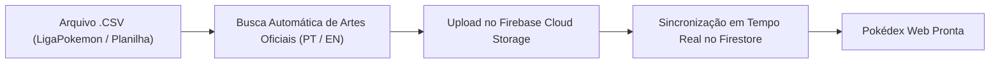

# ⚡ Pokédex TCG Master

A high-performance, mobile-optimized **Pokémon TCG Pokédex & Deck Builder** built with **React 18**, **TypeScript**, **Vite 5**, **Tailwind CSS**, and **Firebase (Auth, Firestore, Storage, Cloud Functions 2nd Gen)**. Features an interactive **gRPC & Connect-RPC Masterclass Hub** demonstrating real-time binary Protocol Buffers serialization over HTTP/2.

---

## 🌟 Key Features

- **📱 Mobile-First Pokédex UI**: Custom Pokédex shell with responsive layout, optical lens animation, LED indicators, and synthesized Web Audio API sound effects.
- **✨ 3D Holographic Foil Cards**: Dynamic parallax mouse/touch tilt, holographic chromatic rainbow shimmer, and light refraction for foil and rare cards.
- **📦 Dynamic Collection & Catalog**: Search by Pokémon name, set code, card number, or text query; filter by 11 elemental types, rarities, foil condition, and deck inclusions.
- **➕ Add Cards & Batch CSV Import**: Add custom cards manually or import entire collections from CSV files (PTCG / LigaPokemon format) directly from the browser.
- **🃏 Deck Builder & Strategy Playbooks**: Build and validate 60-card decks with live category counters (Pokémon, Trainers, Energy), turn-by-turn strategic guides (Opening, Midgame, Endgame), and 1-click export to **PTCG Live**.
- **📖 Rules & 11 Elemental Types Matrix**: Complete interactive guide covering all 11 Pokémon TCG elemental types, competitive formats (Standard, Expanded, Casual), Trainer card categories, and Special Conditions.
- **🔒 Firebase Auth & Email Whitelist**: Google Sign-In (Gmail) with strict environment-defined email whitelisting (`VITE_ALLOWED_EMAILS`).
- **☁️ Cloud Storage & Firestore Sync**: Seamless synchronization of collection quantities, decklists, and personal card notes with automatic fallback from Firebase Storage to official CDNs and procedural CSS cards.
- **⚡ gRPC & Connect-RPC Architecture**: Complete Protocol Buffers contract, serverless Firebase Functions 2nd Gen API, and in-depth repository masterclass guide ([GRPC_CONNECT_RPC_GUIDE.md](GRPC_CONNECT_RPC_GUIDE.md)).

---

## 🏗️ Architecture Overview


---

## 🎓 gRPC & Connect-RPC Masterclass

### What is gRPC?
**gRPC (Google Remote Procedure Call)** is an open-source high-performance RPC framework created by Google. Instead of transferring verbose human-readable JSON over standard HTTP/1.1 REST endpoints, gRPC serializes data into compact binary payloads using **Protocol Buffers (Protobuf)** and multiplexes streams over **HTTP/2**.

### Why Connect-RPC for Web Browsers?
Standard gRPC uses low-level HTTP/2 framing and trailers that standard browser `fetch` and `XMLHttpRequest` APIs cannot construct without an Envoy reverse proxy.

**Connect-RPC** ([connectrpc.com](https://connectrpc.com)) is a modern, lightweight library that implements the gRPC and Connect protocols over standard HTTP POST requests:
- **Zero Proxy Requirement**: Works directly with browsers and serverless functions (like Firebase Cloud Functions 2nd Gen).
- **Dual Serialization**: Supports both binary Protobuf (`application/proto`) and JSON (`application/json`).
- **End-to-End Type Safety**: Generated TypeScript clients provide compile-time contract enforcement.

### Protocol Comparison Matrix

| Feature | REST (OpenAPI) | gRPC & Connect-RPC | GraphQL |
| :--- | :--- | :--- | :--- |
| **Serialization** | Text / JSON (Verbose) | **Binary Protobuf (Compact)** | Text / JSON |
| **Transport Protocol** | HTTP/1.1 or HTTP/2 | **HTTP/2 & HTTP/3** | HTTP/1.1 or HTTP/2 |
| **Wire Bandwidth** | Baseline (100%) | **60% - 75% Reduction** | Moderate |
| **Type Safety** | Optional / Runtime | **Strict (.proto contract)** | Strict (GraphQL Schema) |
| **Client Codegen** | Third-party tooling | **First-Class (Buf / Protoc)** | Codegen plugins |

---

## 🚀 Getting Started

### Prerequisites
- **Node.js 20+ (LTS)** (or Node.js 18+)
- **npm 10+** or **Yarn 1.22+**

### Installation

1. **Clone the repository and enter the directory:**
   ```bash
   git clone <REPO_URL>
   cd pokedex-tcg
   ```

2. **Load the recommended Node version with NVM (optional):**
   ```bash
   nvm use
   ```

3. **Install dependencies (clean install without `--legacy-peer-deps`):**
   ```bash
   npm install
   # or
   yarn install
   ```

4. **Configure Environment Variables:**
   Copy `.env.example` to `.env`:
   ```bash
   cp .env.example .env
   ```

   Edit `.env` with your Firebase project credentials and authorized emails:
   ```env
   # Firebase Config
   VITE_FIREBASE_API_KEY=AIzaSy...
   VITE_FIREBASE_AUTH_DOMAIN=your-project.firebaseapp.com
   VITE_FIREBASE_PROJECT_ID=your-project
   VITE_FIREBASE_STORAGE_BUCKET=your-project.appspot.com
   VITE_FIREBASE_MESSAGING_SENDER_ID=123456789012
   VITE_FIREBASE_APP_ID=1:123456789012:web:abcdef123456

   # Allowed Google Sign-In Emails (comma-separated)
   VITE_ALLOWED_EMAILS=your-email@gmail.com,trainer@pokemon.com

   # Connect-RPC Cloud Functions Endpoint
   VITE_CONNECT_RPC_URL=https://southamerica-east1-your-project.cloudfunctions.net/api
   ```

5. **Start the local development server:**
   ```bash
   npm run dev
   # or
   yarn dev
   ```
   Open your browser at `http://localhost:3000`.

6. **Build for production:**
   ```bash
   npm run build
   ```

---

## 📥 Como Importar sua Coleção de Cartas (CSV & Manual)

O Pokédex TCG oferece suporte a importação de coleções inteiras com **busca automática de imagens oficiais em alta definição** e **persistência direta no Firebase Cloud Storage & Firestore**.



---

### 💻 Método 1: Importação Automática via Terminal (Recomendado)

Com apenas um comando, o script processa sua planilha, localiza e baixa as imagens oficiais em alta resolução, faz o upload em massa para o seu **Google Cloud Storage** e atualiza o catálogo da aplicação:

```bash
# Importar o arquivo padrão da raiz (colecao_completa_consolidada_com_energias.csv):
npm run import:csv

# Ou importar qualquer arquivo CSV personalizado:
npm run import:csv caminho/para/minhas_cartas.csv
```

**O que o comando faz automaticamente:**
1. Lê e estrutura todas as cartas, quantidades, raridades e acabamentos (Foil/Holo).
2. Mapeia com precisão todas as cartas de **Energia Básica** (Planta, Fogo, Água, Raios, Psíquico, Luta, Escuridão, Metal, Fada) e **Energias Especiais** (Bubbly Water Energy, Weakness Guard Energy, etc.).
3. Baixa as imagens em alta resolução em paralelo (multithread).
4. Faz o upload de todas as imagens para o seu bucket no **Firebase Storage** (`gs://seu-projeto.firebasestorage.app/cards/`).
5. Atualiza o catálogo estruturado em `src/data/cards.json`.

---

### 🌐 Método 2: Importação Direta pela Interface Web (Sem Terminal)

Você pode importar cartas diretamente pelo navegador:

1. Abra a aplicação e clique no botão **➕ Add Cards** (no topo da Pokédex).
2. Selecione a aba **Batch CSV Import**.
3. Clique em **Choose File** e selecione seu arquivo `.csv` (ou cole o texto da planilha na caixa de texto).
4. Clique em **Process CSV Import**.
5. As cartas serão adicionadas à sua coleção e sincronizadas automaticamente em tempo real com o seu **Cloud Firestore**.

---

### ✍️ Método 3: Adição Manual de Cartas com Upload de Foto

Para adicionar cartas avulsas que você acabou de tirar em um booster:

1. Clique em **➕ Add Cards** ➡️ aba **Manual Form**.
2. Preencha o nome da carta (PT ou EN), código da coleção (ex: `SVI`, `PAF`, `OBF`), número e quantidade.
3. **Upload de Imagem**:
   - **Opção A**: Selecione uma foto/arquivo diretamente da câmera do seu celular ou do computador. O app faz o upload para o seu Firebase Storage.
   - **Opção B**: Cole uma URL de imagem externa. O app espelha a imagem para o seu Cloud Storage.
4. Clique em **Save Card to Collection & Storage**.

---

### 📊 Formato Padrão de Colunas do CSV

O importador aceita o formato padrão de exportação da **LigaPokemon** e planilhas Pokémon TCG:

| Coluna | Exemplo | Descrição |
| :--- | :--- | :--- |
| `Edicao (PTBR)` | `Caos Ascendente` | Nome da coleção em Português |
| `Edicao (EN)` | `Chaos Rising` | Nome da coleção em Inglês |
| `Edicao (Sigla)` | `CRI` / `SVI` / `MEW` | Sigla oficial da coleção |
| `Card (PT)` | `Charizard ex` | Nome da carta em Português |
| `Card (EN)` | `Charizard ex` | Nome da carta em Inglês |
| `Quantidade` | `1`, `2`, `4` | Quantidade de cópias que você possui |
| `Qualidade` | `M`, `NM`, `SP` | Estado de conservação (Mint, Near Mint...) |
| `Idioma` | `PT`, `EN`, `JP` | Idioma da carta física |
| `Raridade` | `C`, `U`, `R`, `IR`, `S` | Código de raridade |
| `Cor` | `R`, `W`, `G`, `L`, `P`, `E` | Tipo de energia (Fogo, Água, Planta...) |
| `Extras` | `Foil`, `Holo`, `Reverse` | Acabamento holográfico |
| `Card #` | `54`, `087`, `213` | Número da carta na coleção |
| `Comentario` | `Pasta 1` | Anotações pessoais de organização |
| `# Cards na Edicao` | `198` | Total de cartas na coleção |

**Exemplo de linha CSV:**
```csv
Caos Ascendente,Chaos Rising,CRI,Charizard ex,Charizard ex,1,M,PT,IR,R,Foil,087,Pasta Principal,198
```

---

## 🖼️ Card Image Pipeline & Firebase Storage

Card images are dynamically loaded in cascading order:
1. **Firebase Storage**: If `VITE_FIREBASE_STORAGE_BUCKET` is configured in `.env`.
2. **High-Resolution Official CDNs**: Direct fallback to official Pokemon TCG / Limitless CDN assets.
3. **Procedural CSS Pokédex Card**: Dynamic styled card fallback in pure HTML/CSS.

### Downloading & Uploading Card Images

```bash
# 1. Download card images to temporary local directory (downloads/cards/):
npm run download:cards

# 2. Upload images to your Firebase Storage bucket:
npm run upload:firebase your-project.appspot.com
```

---

## ☁️ Firebase Deployment

The repository uses automated configuration synchronization driven by your local `.env` file (which is ignored by Git to protect personal data).

### 1. Enable Firebase Authentication & Google Sign-In (Console 1-Time Setup)
Because Google OAuth requires Google Identity Client ID credentials, activate it in the Firebase Console:
1. Open [Firebase Console > Authentication](https://console.firebase.google.com/).
2. Under **Sign-in method**, click **Add new provider** ➡️ select **Google** ➡️ enable and choose your support email.
3. Under **Settings > Authorized domains**, click **Add domain** and enter your custom domain (e.g. `pokemon.vitoresende.dev` or `yourdomain.com`).

### 2. Login to Firebase CLI
```bash
# Ensure Node 20 LTS is active:
nvm use

# Login to Firebase CLI:
npm run firebase:login
```

### 3. Deploy Application Services
```bash
# Syncs .env, builds React production bundle, and deploys all services (Hosting, Functions, Firestore, Storage):
npm run firebase:deploy

# Or deploy only the Frontend (Hosting):
npm run firebase:hosting

# Or deploy only the Backend Serverless API (Cloud Functions):
npm run firebase:functions
```

### 📋 Available Firebase Scripts
- `npm run firebase:deploy`: Full deployment (React Hosting + Cloud Functions 2nd Gen + Firestore Rules/Indexes + Storage Rules).
- `npm run firebase:hosting`: Builds and deploys only the frontend React application.
- `npm run firebase:functions`: Builds and deploys only the Connect-RPC backend Cloud Functions.
- `npm run firebase:sync`: Manually syncs your `.env` variables to `.firebaserc` and `firebase.json`.
- `npm run firebase:emulators`: Launches local Firebase emulators for offline development.

---

## 📂 Project Structure

```
pokedex-tcg/
├── GRPC_CONNECT_RPC_GUIDE.md        # Comprehensive gRPC & Connect-RPC architectural guide
├── proto/                          # Protocol Buffers Schemas (.proto)
│   ├── pokedex/v1/pokedex.proto    # Pokedex RPC service definitions
│   └── user/v1/user.proto          # User profile RPC service definitions
├── functions/                      # Firebase Cloud Functions 2nd Gen Backend
│   ├── src/index.ts                # Express + Connect-RPC Serverless API
│   └── package.json
├── public/                         # Static Assets
│   ├── energy/                     # Official Pokémon TCG Card Energy Symbols (11 Types)
│   ├── favicon.ico                 # Fallback Favicon
│   └── favicon.svg                 # Pokédex SVG Favicon
├── scripts/                        # Utility Scripts
│   ├── download_images.py          # Multithreaded card image downloader
│   ├── upload_to_firebase.js       # Firebase Storage upload script
│   └── sync_firebase_config.js     # Dynamic .env to Firebase config synchronizer
├── src/
│   ├── components/                 # React UI Components
│   │   ├── AccessGate.tsx          # Full-screen Google Sign-In & Whitelist security gate
│   │   ├── AddCardModal.tsx        # Add card & CSV import modal
│   │   ├── BottomNavigation.tsx    # Mobile-optimized bottom navigation
│   │   ├── CardDetailModal.tsx     # Card inspection, notes & deck inclusion
│   │   ├── CardGrid.tsx            # Card grid with pagination
│   │   ├── CardItem.tsx            # Individual card item with quantity +/-
│   │   ├── CreateDeckModal.tsx     # Custom deck builder modal
│   │   ├── FilterBar.tsx           # Type pills with official energy icons & filters
│   │   ├── HoloCard.tsx            # 3D parallax holographic card component
│   │   ├── PokedexHeader.tsx       # Header with lens, LEDs, audio switch & profile
│   │   └── PokemonTypeIcon.tsx     # Official Pokémon TCG Card Energy icon component
│   ├── context/                    # React Contexts (AuthContext, CollectionContext)
│   ├── data/                       # Initial JSON Datasets (Types, Rules, Decks)
│   ├── pages/                      # Application Views
│   │   ├── AuthProfilePage.tsx     # Google Auth, whitelist & cloud sync
│   │   ├── DecksPage.tsx           # Deck management & strategy playbooks
│   │   ├── PokedexPage.tsx         # Main Pokédex collection view
│   │   └── RulesAndTypesPage.tsx   # 11 elemental types with official energy icons & rules
│   ├── services/                   # Web Audio, Firebase & Connect-RPC clients
│   ├── types/                      # TypeScript definitions & interfaces
│   ├── App.tsx                     # App layout & routing
│   └── main.tsx                    # React DOM entry point
├── .env.example                    # Environment variable template with documentation
├── .gitignore                      # Git ignore rules (protects private CSVs, keys & configs)
├── .nvmrc                          # Recommended Node.js version (20 LTS)
├── firebase.template.json          # Clean Firebase template (tracked in Git)
├── firestore.indexes.json          # Cloud Firestore index configuration
├── firestore.rules                 # Cloud Firestore security rules
├── storage.rules                   # Firebase Storage security rules
├── package.json                    # Dependencies & scripts
├── tailwind.config.js              # Pokédex theme tokens & colors
└── vite.config.ts                  # Vite build config with chunk splitting
```

---

## 📜 License

MIT License. Open source and built for Pokémon TCG collectors and competitive players worldwide.
