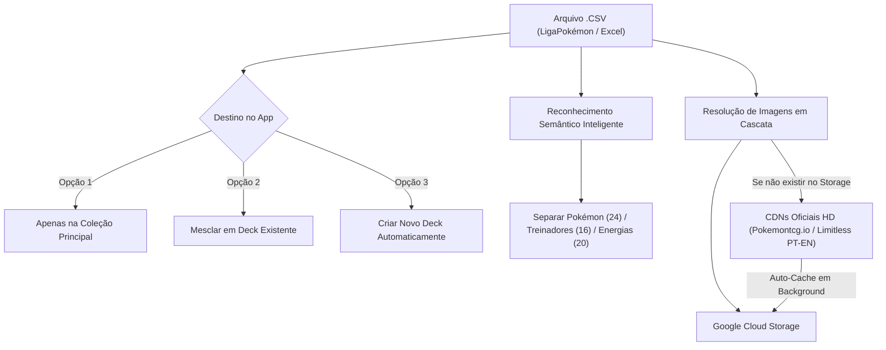
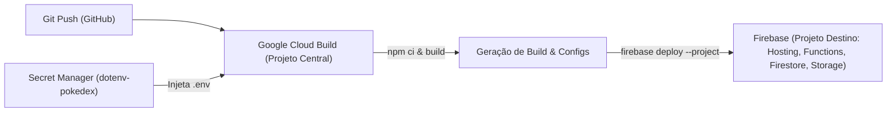

# ⚡ Pokédex TCG Master

A high-performance, mobile-optimized **Pokémon TCG Pokédex & Deck Builder** built with **React 18**, **TypeScript**, **Vite 5**, **Tailwind CSS**, and **Firebase (Auth, Firestore, Storage, Cloud Functions 2nd Gen)**. Features an interactive **gRPC & Connect-RPC Masterclass Hub** demonstrating real-time binary Protocol Buffers serialization over HTTP/2.

---

## 🌟 Key Features

- **📱 Mobile-First Pokédex UI**: Custom Pokédex shell with responsive layout, optical lens animation, LED indicators, and synthesized Web Audio API sound effects.
- **✨ 3D Holographic Foil Cards**: Dynamic parallax mouse/touch tilt, holographic chromatic rainbow shimmer, and light refraction for foil and rare cards.
- **📦 Dynamic Collection & Catalog**: Search by Pokémon name, set code, card number, or text query; filter by 11 elemental types, rarities, foil condition, and deck inclusions.
- **➕ Add Cards & Batch CSV Import**: Add custom cards manually or import entire collections from CSV files (PTCG / LigaPokemon format) directly from the browser.
- **🃏 Deck Builder & Strategy Playbooks**: Build and validate 60-card decks with live category counters (Pokémon, Trainers, Energy), turn-by-turn strategic guides (Opening, Midgame, Endgame), and 1-click export to **PTCG Live**.
- **📖 Rules & 11 Elemental Types Matrix**: Complete interactive guide covering all 11 Pokémon TCG elemental types, competitive formats (Standard, Expanded, Casual), Trainer card categories, and Special Conditions.
- **🔒 Firebase Auth & Email Whitelist**: Google Sign-In (Gmail) with strict environment-defined email whitelisting (`VITE_ALLOWED_EMAILS`).
- **☁️ Cloud Storage & Firestore Sync**: Seamless synchronization of collection quantities, decklists, and personal card notes with automatic fallback from Firebase Storage to official CDNs and procedural CSS cards.
- **⚡ gRPC & Connect-RPC Architecture**: Complete Protocol Buffers contract, serverless Firebase Functions 2nd Gen API, and in-depth repository masterclass guide ([GRPC_CONNECT_RPC_GUIDE.md](GRPC_CONNECT_RPC_GUIDE.md)).

---

## 🏗️ Architecture Overview


---

## 🎓 gRPC & Connect-RPC Masterclass

### What is gRPC?
**gRPC (Google Remote Procedure Call)** is an open-source high-performance RPC framework created by Google. Instead of transferring verbose human-readable JSON over standard HTTP/1.1 REST endpoints, gRPC serializes data into compact binary payloads using **Protocol Buffers (Protobuf)** and multiplexes streams over **HTTP/2**.

### Why Connect-RPC for Web Browsers?
Standard gRPC uses low-level HTTP/2 framing and trailers that standard browser `fetch` and `XMLHttpRequest` APIs cannot construct without an Envoy reverse proxy.

**Connect-RPC** ([connectrpc.com](https://connectrpc.com)) is a modern, lightweight library that implements the gRPC and Connect protocols over standard HTTP POST requests:
- **Zero Proxy Requirement**: Works directly with browsers and serverless functions (like Firebase Cloud Functions 2nd Gen).
- **Dual Serialization**: Supports both binary Protobuf (`application/proto`) and JSON (`application/json`).
- **End-to-End Type Safety**: Generated TypeScript clients provide compile-time contract enforcement.

### Protocol Comparison Matrix

| Feature | REST (OpenAPI) | gRPC & Connect-RPC | GraphQL |
| :--- | :--- | :--- | :--- |
| **Serialization** | Text / JSON (Verbose) | **Binary Protobuf (Compact)** | Text / JSON |
| **Transport Protocol** | HTTP/1.1 or HTTP/2 | **HTTP/2 & HTTP/3** | HTTP/1.1 or HTTP/2 |
| **Wire Bandwidth** | Baseline (100%) | **60% - 75% Reduction** | Moderate |
| **Type Safety** | Optional / Runtime | **Strict (.proto contract)** | Strict (GraphQL Schema) |
| **Client Codegen** | Third-party tooling | **First-Class (Buf / Protoc)** | Codegen plugins |

---

## 🚀 Getting Started

### Prerequisites
- **Node.js 20+ (LTS)** (or Node.js 18+)
- **npm 10+** or **Yarn 1.22+**

### Installation

1. **Clone the repository and enter the directory:**
   ```bash
   git clone <REPO_URL>
   cd pokedex-tcg
   ```

2. **Load the recommended Node version with NVM (optional):**
   ```bash
   nvm use
   ```

3. **Install dependencies (clean install without `--legacy-peer-deps`):**
   ```bash
   npm install
   # or
   yarn install
   ```

4. **Configure Environment Variables:**
   Copy `.env.example` to `.env`:
   ```bash
   cp .env.example .env
   ```

   Edit `.env` with your Firebase project credentials and authorized emails:
   ```env
   # Firebase Config
   VITE_FIREBASE_API_KEY=AIzaSy...
   VITE_FIREBASE_AUTH_DOMAIN=your-project.firebaseapp.com
   VITE_FIREBASE_PROJECT_ID=your-project
   VITE_FIREBASE_STORAGE_BUCKET=your-project.appspot.com
   VITE_FIREBASE_MESSAGING_SENDER_ID=123456789012
   VITE_FIREBASE_APP_ID=1:123456789012:web:abcdef123456

   # Allowed Google Sign-In Emails (comma-separated)
   VITE_ALLOWED_EMAILS=your-email@gmail.com,trainer@pokemon.com

   # Connect-RPC Cloud Functions Endpoint
   VITE_CONNECT_RPC_URL=https://southamerica-east1-your-project.cloudfunctions.net/api
   ```

5. **Start the local development server:**
   ```bash
   npm run dev
   # or
   yarn dev
   ```
   Open your browser at `http://localhost:3000`.

6. **Build for production:**
   ```bash
   npm run build
   ```

---

## 📥 Como Importar Cartas e Decks (Formato LigaPokémon / CSV)

O **Pokédex TCG Master** possui um motor de ingestão completo capaz de processar listas de coleção e decks inteiros com **reconhecimento semântico de Treinadores e Energias**, **criação dinâmica de decks**, **busca em cascata de artes oficiais em alta definição** e **auto-persistência no Google Cloud Storage & Firestore**.



---

### 🗂️ Arquivo de Exemplo Pronto para Teste
O repositório já inclui um arquivo de exemplo com um deck oficial de **60 cartas no padrão LigaPokémon**:
- 📄 **[examples/deck_exemplo_liga_pokemon.csv](examples/deck_exemplo_liga_pokemon.csv)** (Deck *Necrozma & Malamar / Laser Focus*)

---

### 🌐 Método 1: Importação Direta pela Interface Web (Recomendado)

1. Abra a aplicação no navegador e clique em **`➕ Add Cards`** no canto superior direito.
2. Acesse a aba **`Batch CSV Import`**.
3. Escolha o arquivo `.csv` no seu computador (ou cole o texto da planilha na caixa de texto).
4. Selecione o **Destino do Deck (Deck Assignment)**:
   - **`Collection Only`**: Adiciona ou soma as cartas à sua coleção geral sem vincular a nenhum deck.
   - **`Existing Deck`**: Selecione um deck existente no dropdown; todas as cartas importadas serão adicionadas a ele e as estatísticas do deck serão recalculadas.
   - **`+ New Deck`**: Digite o nome do deck (ex: *"Malamar & Necrozma Turbo"*) e selecione o formato (*Standard / Expanded / Casual*). O app criará o deck instantaneamente com todas as cartas já organizadas nas seções corretas.
5. Clique em **`Process CSV Import`**.

---

### 💻 Método 2: Importação em Lote via Terminal (CLI)

Para desenvolvedores ou importação prévia de grandes lotes de imagens:

```bash
# 1. Importar o CSV de exemplo do projeto:
npm run import:csv examples/deck_exemplo_liga_pokemon.csv

# 2. Ou importar qualquer arquivo CSV personalizado:
npm run import:csv caminho/para/minhas_cartas.csv
```

**O que o comando faz automaticamente:**
1. Lê o CSV com suporte a caracteres em Português (`UTF-8` e `latin1/Windows-1252`).
2. Identifica e categoriza Pokémon, Treinadores e Energias.
3. Baixa em paralelo os scans oficiais em HD da TPCI / Limitless.
4. Faz o upload em massa para o Google Cloud Storage (`gs://seu-projeto.firebasestorage.app/cards/`).
5. Atualiza o catálogo estruturado em `src/data/cards.json`.

---

### ✍️ Método 3: Adição Manual de Cartas com Upload de Foto

Para cadastrar cartas avulsas tiradas em boosters físicos:

1. Clique em **`➕ Add Cards`** ➡️ aba **`Manual Form`**.
2. Preencha o nome (PT ou EN), código da coleção (ex: `SVI`, `PAF`, `CRI`), número e quantidade.
3. **Upload de Foto**:
   - **Opção A**: Selecione uma foto/arquivo diretamente da câmera do celular ou do computador. O app enviará a imagem diretamente para o Firebase Storage.
   - **Opção B**: Cole uma URL de imagem externa. O app espelhará a imagem para o seu Cloud Storage.
4. Clique em **`Save Card to Collection & Storage`**.

---

### 📊 Formato Padrão de 14 Colunas da LigaPokémon

O importador aceita o cabeçalho e layout padrão de 14 colunas da LigaPokémon:

| # | Coluna | Exemplo | Descrição |
| :-: | :--- | :--- | :--- |
| 1 | `Edicao (PTBR)` | `Sintonia Mental` | Nome da coleção em Português |
| 2 | `Edicao (EN)` | `Unified Minds` | Nome da coleção em Inglês |
| 3 | `Edicao (Sigla)` | `UNM` / `FLI` / `CRI` | Sigla oficial de 3 letras da coleção |
| 4 | `Card (PT)` | `Caça-Inseto` | Nome da carta em Português |
| 5 | `Card (EN)` | `Bug Catcher` | Nome da carta em Inglês |
| 6 | `Quantidade` | `2` | Quantidade de cópias |
| 7 | `Qualidade` | `NM` / `M` / `SP` | Estado de conservação (*Near Mint, Mint...*) |
| 8 | `Idioma` | `PT` / `EN` | Idioma da carta física |
| 9 | `Raridade` | `C` / `U` / `R` / `IR` | Código de raridade |
| 10 | `Cor` | `P`, `R`, `W`, `C`, `E` | Tipo de energia ou `C` (Treinadores / Incolor) |
| 11 | `Extras` | `Foil`, `Holo`, `Reverse` | Acabamento holográfico |
| 12 | `Card #` | `189` | Número da carta na coleção |
| 13 | `Comentario` | `Deck Principal` | Anotações pessoais de organização |
| 14 | `# Cards na Edicao` | `236` | Total de cartas na coleção |

**Exemplo de linha CSV:**
```csv
"Sintonia Mental","Unified Minds",UNM,"Caça-Inseto","Bug Catcher",2,"NM",PT,U,C,"",189,"",236
```

---

### 🧠 Reconhecimento Inteligente e Tratamento de Imagens

1. **Classificação Automática de Treinadores e Energias**:
   - Mesmo que a LigaPokémon exporte cartas de Treinador (*Apoiadores, Itens, Ferramentas*) com `Cor: C`, o analisador semântico identifica as cartas pelo nome (*Cynthia, Lillie, Bug Catcher, Switch, Mysterious Treasure, etc.*) e as aloca corretamente na coluna de **Trainers**.
2. **Auto-Persistência de Imagens no Cloud Storage**:
   - Ao importar novas cartas cujo scan ainda não esteja salvo no Cloud Storage, o app busca a imagem nos CDNs oficiais em tempo real.
   - Assim que a imagem carrega no navegador, uma rotina em background faz o download e salva o arquivo `.png` no seu **Google Cloud Storage** (`gs://seu-projeto.firebasestorage.app/cards/`), tornando-a nativa e permanente para os próximos acessos.

---

## 🖼️ Card Image Pipeline & Firebase Storage

Card images are dynamically loaded in cascading order:
1. **Firebase Storage**: If `VITE_FIREBASE_STORAGE_BUCKET` is configured in `.env`.
2. **High-Resolution Official CDNs**: Direct fallback to official Pokemon TCG / Limitless CDN assets.
3. **Procedural CSS Pokédex Card**: Dynamic styled card fallback in pure HTML/CSS.

### Downloading & Uploading Card Images

```bash
# 1. Download card images to temporary local directory (downloads/cards/):
npm run download:cards

# 2. Upload images to your Firebase Storage bucket:
npm run upload:firebase your-project.appspot.com
```

---

## ☁️ Firebase Deployment

The repository uses automated configuration synchronization driven by your local `.env` file (which is ignored by Git to protect personal data).

### 1. Enable Firebase Authentication & Google Sign-In (Console 1-Time Setup)
Because Google OAuth requires Google Identity Client ID credentials, activate it in the Firebase Console:
1. Open [Firebase Console > Authentication](https://console.firebase.google.com/).
2. Under **Sign-in method**, click **Add new provider** ➡️ select **Google** ➡️ enable and choose your support email.
3. Under **Settings > Authorized domains**, click **Add domain** and enter your custom domain (e.g. `pokemon.vitoresende.dev` or `yourdomain.com`).

### 2. Login to Firebase CLI
```bash
# Ensure Node 20 LTS is active:
nvm use

# Login to Firebase CLI:
npm run firebase:login
```

### 3. Deploy Application Services
```bash
# Syncs .env, builds React production bundle, and deploys all services (Hosting, Functions, Firestore, Storage):
npm run firebase:deploy

# Or deploy only the Frontend (Hosting):
npm run firebase:hosting

# Or deploy only the Backend Serverless API (Cloud Functions):
npm run firebase:functions
```

### 📋 Available Firebase Scripts
- `npm run firebase:deploy`: Full deployment (React Hosting + Cloud Functions 2nd Gen + Firestore Rules/Indexes + Storage Rules).
- `npm run firebase:hosting`: Builds and deploys only the frontend React application.
- `npm run firebase:functions`: Builds and deploys only the Connect-RPC backend Cloud Functions.
- `npm run firebase:sync`: Manually syncs your `.env` variables to `.firebaserc` and `firebase.json`.
- `npm run firebase:emulators`: Launches local Firebase emulators for offline development.

---

## 🛠️ CI/CD Automático com Google Cloud Build & Secret Manager

O repositório inclui um arquivo [`cloudbuild.yaml`](cloudbuild.yaml) pronto para fazer o **deploy automático para o Firebase** a cada push no repositório, garantindo **Zero Informações Pessoais** no código-fonte através do **Google Secret Manager**.

Suporta tanto projetos únicos quanto arquitetura **Multi-Projetos / Cross-Project** (onde o Cloud Build e o Secret Manager rodam em um Projeto Central de DevOps/CI-CD, e o deploy é direcionado para o projeto destino do Firebase).



---

### 1. Salvar o Segredo no Secret Manager (No Projeto do Cloud Build)
No projeto onde o Cloud Build está configurado, salve o `.env` com o nome padrão `dotenv-pokedex`:

```bash
# Cria o Secret no projeto:
gcloud secrets create dotenv-pokedex --data-file=.env

# (Caso queira atualizar os valores no futuro):
gcloud secrets versions add dotenv-pokedex --data-file=.env
```

---

### 2. Conceder Permissões de Acesso (IAM & Cross-Project)

A conta de serviço do Cloud Build (`[NUMERO_PROJETO_CENTRAL]@cloudbuild.gserviceaccount.com`) precisa de permissões no **Projeto Central** (para ler o segredo) e no **Projeto Destino do Firebase** (para fazer o deploy):

#### A. No Projeto Central (onde roda o Cloud Build e está o Secret):
```bash
# Obtenha o número do projeto central:
CENTRAL_PROJECT_ID="seu-projeto-central"
CENTRAL_NUM=$(gcloud projects describe ${CENTRAL_PROJECT_ID} --format="value(projectNumber)")
CB_SA="${CENTRAL_NUM}@cloudbuild.gserviceaccount.com"

# Permissão para ler o Secret:
gcloud projects add-iam-policy-binding ${CENTRAL_PROJECT_ID} \
  --member="serviceAccount:${CB_SA}" \
  --role="roles/secretmanager.secretAccessor"
```

#### B. No Projeto Destino (onde está o Firebase e as Cloud Functions):
```bash
FIREBASE_TARGET_PROJECT_ID="seu-projeto-firebase"

# Permissão de Administrador do Firebase:
gcloud projects add-iam-policy-binding ${FIREBASE_TARGET_PROJECT_ID} \
  --member="serviceAccount:${CB_SA}" \
  --role="roles/firebase.admin"

# Permissões para Cloud Functions & Cloud Run (2nd Gen):
gcloud projects add-iam-policy-binding ${FIREBASE_TARGET_PROJECT_ID} \
  --member="serviceAccount:${CB_SA}" \
  --role="roles/cloudfunctions.admin"

gcloud projects add-iam-policy-binding ${FIREBASE_TARGET_PROJECT_ID} \
  --member="serviceAccount:${CB_SA}" \
  --role="roles/iam.serviceAccountUser"

gcloud projects add-iam-policy-binding ${FIREBASE_TARGET_PROJECT_ID} \
  --member="serviceAccount:${CB_SA}" \
  --role="roles/run.admin"
```

---

### 3. Criar o Trigger no Cloud Build
1. Abra o [Google Cloud Build Triggers](https://console.cloud.google.com/cloud-build/triggers) no seu projeto central.
2. Clique em **Create Trigger**.
3. Conecte o repositório GitHub (`pokedex-tcg`).
4. Selecione o evento: **Push to a branch** (ex: `^main$`).
5. Em **Configuration**, escolha **Cloud Build configuration file (yaml or json)** com o caminho `cloudbuild.yaml`.
6. Clique em **Create**.

---

### 4. Executar um Build Manual pelo Terminal (Opcional)
Para testar o pipeline imediatamente a partir do projeto central:
```bash
gcloud builds submit --project=seu-projeto-central --config=cloudbuild.yaml
```

---

## 📂 Project Structure

```
pokedex-tcg/
├── GRPC_CONNECT_RPC_GUIDE.md        # Comprehensive gRPC & Connect-RPC architectural guide
├── proto/                          # Protocol Buffers Schemas (.proto)
│   ├── pokedex/v1/pokedex.proto    # Pokedex RPC service definitions
│   └── user/v1/user.proto          # User profile RPC service definitions
├── functions/                      # Firebase Cloud Functions 2nd Gen Backend
│   ├── src/index.ts                # Express + Connect-RPC Serverless API
│   └── package.json
├── public/                         # Static Assets
│   ├── energy/                     # Official Pokémon TCG Card Energy Symbols (11 Types)
│   ├── favicon.ico                 # Fallback Favicon
│   └── favicon.svg                 # Pokédex SVG Favicon
├── scripts/                        # Utility Scripts
│   ├── download_images.py          # Multithreaded card image downloader
│   ├── upload_to_firebase.js       # Firebase Storage upload script
│   └── sync_firebase_config.js     # Dynamic .env to Firebase config synchronizer
├── src/
│   ├── components/                 # React UI Components
│   │   ├── AccessGate.tsx          # Full-screen Google Sign-In & Whitelist security gate
│   │   ├── AddCardModal.tsx        # Add card & CSV import modal
│   │   ├── BottomNavigation.tsx    # Mobile-optimized bottom navigation
│   │   ├── CardDetailModal.tsx     # Card inspection, notes & deck inclusion
│   │   ├── CardGrid.tsx            # Card grid with pagination
│   │   ├── CardItem.tsx            # Individual card item with quantity +/-
│   │   ├── CreateDeckModal.tsx     # Custom deck builder modal
│   │   ├── FilterBar.tsx           # Type pills with official energy icons & filters
│   │   ├── HoloCard.tsx            # 3D parallax holographic card component
│   │   ├── PokedexHeader.tsx       # Header with lens, LEDs, audio switch & profile
│   │   └── PokemonTypeIcon.tsx     # Official Pokémon TCG Card Energy icon component
│   ├── context/                    # React Contexts (AuthContext, CollectionContext)
│   ├── data/                       # Initial JSON Datasets (Types, Rules, Decks)
│   ├── pages/                      # Application Views
│   │   ├── AuthProfilePage.tsx     # Google Auth, whitelist & cloud sync
│   │   ├── DecksPage.tsx           # Deck management & strategy playbooks
│   │   ├── PokedexPage.tsx         # Main Pokédex collection view
│   │   └── RulesAndTypesPage.tsx   # 11 elemental types with official energy icons & rules
│   ├── services/                   # Web Audio, Firebase & Connect-RPC clients
│   ├── types/                      # TypeScript definitions & interfaces
│   ├── App.tsx                     # App layout & routing
│   └── main.tsx                    # React DOM entry point
├── .env.example                    # Environment variable template with documentation
├── .gitignore                      # Git ignore rules (protects private CSVs, keys & configs)
├── .nvmrc                          # Recommended Node.js version (20 LTS)
├── firebase.template.json          # Clean Firebase template (tracked in Git)
├── firestore.indexes.json          # Cloud Firestore index configuration
├── firestore.rules                 # Cloud Firestore security rules
├── storage.rules                   # Firebase Storage security rules
├── package.json                    # Dependencies & scripts
├── tailwind.config.js              # Pokédex theme tokens & colors
└── vite.config.ts                  # Vite build config with chunk splitting
```

---

## 📜 License

MIT License. Open source and built for Pokémon TCG collectors and competitive players worldwide.
