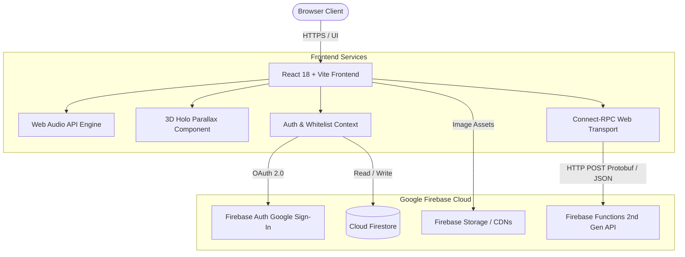

# ⚡ Pokédex TCG Master

A high-performance, mobile-optimized **Pokémon TCG Pokédex & Deck Builder** built with **React 18**, **TypeScript**, **Vite 5**, **Tailwind CSS**, and **Firebase (Auth, Firestore, Storage, Cloud Functions 2nd Gen)**. Features an interactive **gRPC & Connect-RPC Masterclass Hub** demonstrating real-time binary Protocol Buffers serialization over HTTP/2.

---

## 🌟 Key Features

- **📱 Mobile-First Pokédex UI**: Custom Pokédex shell with responsive layout, optical lens animation, LED indicators, and synthesized Web Audio API sound effects.
- **✨ 3D Holographic Foil Cards**: Dynamic parallax mouse/touch tilt, holographic chromatic rainbow shimmer, and light refraction for foil and rare cards.
- **📦 Dynamic Collection & Catalog**: Search by Pokémon name, set code, card number, or text query; filter by 11 elemental types, rarities, foil condition, and deck inclusions.
- **➕ Add Cards & Batch CSV Import**: Add custom cards manually or import entire collections from CSV files (PTCG / LigaPokemon format) directly from the browser.
- **🃏 Deck Builder & Strategy Playbooks**: Build and validate 60-card decks with live category counters (Pokémon, Trainers, Energy), turn-by-turn strategic guides (Opening, Midgame, Endgame), and 1-click export to **PTCG Live**.
- **📖 Rules & 11 Elemental Types Matrix**: Complete interactive guide covering all 11 Pokémon TCG elemental types, competitive formats (Standard, Expanded, Casual), Trainer card categories, and Special Conditions.
- **🔒 Firebase Auth & Email Whitelist**: Google Sign-In (Gmail) with strict environment-defined email whitelisting (`VITE_ALLOWED_EMAILS`).
- **☁️ Cloud Storage & Firestore Sync**: Seamless synchronization of collection quantities, decklists, and personal card notes with automatic fallback from Firebase Storage to official CDNs and procedural CSS cards.
- **⚡ gRPC & Connect-RPC Educational Hub**: Interactive Protobuf execution engine, wire payload size comparison (Protobuf vs JSON), and architecture masterclass.

---

## 🏗️ Architecture Overview



---

## 🎓 gRPC & Connect-RPC Masterclass

### What is gRPC?
**gRPC (Google Remote Procedure Call)** is an open-source high-performance RPC framework created by Google. Instead of transferring verbose human-readable JSON over standard HTTP/1.1 REST endpoints, gRPC serializes data into compact binary payloads using **Protocol Buffers (Protobuf)** and multiplexes streams over **HTTP/2**.

### Why Connect-RPC for Web Browsers?
Standard gRPC uses low-level HTTP/2 framing and trailers that standard browser `fetch` and `XMLHttpRequest` APIs cannot construct without an Envoy reverse proxy.

**Connect-RPC** ([connectrpc.com](https://connectrpc.com)) is a modern, lightweight library that implements the gRPC and Connect protocols over standard HTTP POST requests:
- **Zero Proxy Requirement**: Works directly with browsers and serverless functions (like Firebase Cloud Functions 2nd Gen).
- **Dual Serialization**: Supports both binary Protobuf (`application/proto`) and JSON (`application/json`).
- **End-to-End Type Safety**: Generated TypeScript clients provide compile-time contract enforcement.

### Protocol Comparison Matrix

| Feature | REST (OpenAPI) | gRPC & Connect-RPC | GraphQL |
| :--- | :--- | :--- | :--- |
| **Serialization** | Text / JSON (Verbose) | **Binary Protobuf (Compact)** | Text / JSON |
| **Transport Protocol** | HTTP/1.1 or HTTP/2 | **HTTP/2 & HTTP/3** | HTTP/1.1 or HTTP/2 |
| **Wire Bandwidth** | Baseline (100%) | **60% - 75% Reduction** | Moderate |
| **Type Safety** | Optional / Runtime | **Strict (.proto contract)** | Strict (GraphQL Schema) |
| **Client Codegen** | Third-party tooling | **First-Class (Buf / Protoc)** | Codegen plugins |

---

## 🚀 Getting Started

### Prerequisites
- **Node.js 20+ (LTS)** (or Node.js 18+)
- **npm 10+** or **Yarn 1.22+**

### Installation

1. **Clone the repository and enter the directory:**
   ```bash
   git clone <REPO_URL>
   cd pokedex-tcg
   ```

2. **Load the recommended Node version with NVM (optional):**
   ```bash
   nvm use
   ```

3. **Install dependencies (clean install without `--legacy-peer-deps`):**
   ```bash
   npm install
   # or
   yarn install
   ```

4. **Configure Environment Variables:**
   Copy `.env.example` to `.env`:
   ```bash
   cp .env.example .env
   ```

   Edit `.env` with your Firebase project credentials and authorized emails:
   ```env
   # Firebase Config
   VITE_FIREBASE_API_KEY=AIzaSy...
   VITE_FIREBASE_AUTH_DOMAIN=your-project.firebaseapp.com
   VITE_FIREBASE_PROJECT_ID=your-project
   VITE_FIREBASE_STORAGE_BUCKET=your-project.appspot.com
   VITE_FIREBASE_MESSAGING_SENDER_ID=123456789012
   VITE_FIREBASE_APP_ID=1:123456789012:web:abcdef123456

   # Allowed Google Sign-In Emails (comma-separated)
   VITE_ALLOWED_EMAILS=your-email@gmail.com,trainer@pokemon.com

   # Connect-RPC Cloud Functions Endpoint
   VITE_CONNECT_RPC_URL=https://southamerica-east1-your-project.cloudfunctions.net/api
   ```

5. **Start the local development server:**
   ```bash
   npm run dev
   # or
   yarn dev
   ```
   Open your browser at `http://localhost:3000`.

6. **Build for production:**
   ```bash
   npm run build
   ```

---

## 🖼️ Card Image Pipeline & Firebase Storage

Card images are dynamically loaded in cascading order:
1. **Firebase Storage**: If `VITE_FIREBASE_STORAGE_BUCKET` is configured in `.env`.
2. **High-Resolution Official CDNs**: Direct fallback to official Pokemon TCG / Limitless CDN assets.
3. **Procedural CSS Pokédex Card**: Dynamic styled card fallback in pure HTML/CSS.

### Downloading & Uploading Card Images

```bash
# 1. Download card images to temporary local directory (downloads/cards/):
npm run download:cards

# 2. Upload images to your Firebase Storage bucket:
npm run upload:firebase your-project.appspot.com
```

---

## ☁️ Firebase Deployment

Deploy both the Vite frontend and the Connect-RPC Cloud Functions backend:

```bash
# 1. Login to Firebase CLI
npx firebase login

# 2. Set active project
npx firebase use your-project-id

# 3. Deploy Firestore rules, Storage rules, Functions, and Hosting:
npx firebase deploy
```

---

## 📂 Project Structure

```
pokedex-tcg/
├── proto/                          # Protocol Buffers Schemas (.proto)
│   ├── pokedex/v1/pokedex.proto    # Pokedex RPC service definitions
│   └── user/v1/user.proto          # User profile RPC service definitions
├── functions/                      # Firebase Cloud Functions 2nd Gen Backend
│   ├── src/index.ts                # Express + Connect-RPC Serverless API
│   └── package.json
├── public/                         # Static Assets & Favicon
├── scripts/                        # Utility Scripts
│   ├── download_images.py          # Multithreaded card image downloader
│   └── upload_to_firebase.js       # Firebase Storage upload script
├── src/
│   ├── components/                 # React UI Components
│   │   ├── AddCardModal.tsx        # Add card & CSV import modal
│   │   ├── BottomNavigation.tsx    # Mobile-optimized bottom navigation
│   │   ├── CardDetailModal.tsx     # Card inspection, notes & deck inclusion
│   │   ├── CardGrid.tsx            # Card grid with pagination
│   │   ├── CardItem.tsx            # Individual card item with quantity +/-
│   │   ├── CreateDeckModal.tsx     # Custom deck builder modal
│   │   ├── FilterBar.tsx           # Type pills, search & attribute filters
│   │   ├── HoloCard.tsx            # 3D parallax holographic card component
│   │   ├── PokedexHeader.tsx       # Header with lens, LEDs & audio switch
│   │   └── UnauthorizedModal.tsx   # Whitelist security warning modal
│   ├── context/                    # React Contexts (Auth, Collection)
│   ├── data/                       # Initial JSON Datasets (Types, Rules, Decks)
│   ├── pages/                      # Application Views
│   │   ├── AuthProfilePage.tsx     # Google Auth, whitelist & cloud sync
│   │   ├── DecksPage.tsx           # Deck management & strategy playbooks
│   │   ├── GrpcLearningHub.tsx     # gRPC / Connect-RPC educational hub
│   │   ├── PokedexPage.tsx         # Main Pokédex collection view
│   │   └── RulesAndTypesPage.tsx   # 11 elemental types & battle formats
│   ├── services/                   # Web Audio, Firebase & Connect-RPC clients
│   ├── types/                      # TypeScript definitions & interfaces
│   ├── App.tsx                     # App layout & routing
│   └── main.tsx                    # React DOM entry point
├── .env.example                    # Environment variable template
├── .gitignore                      # Git ignore rules (protects private data)
├── .nvmrc                          # Recommended Node.js version (20 LTS)
├── firebase.json                   # Firebase deployment configuration
├── firestore.rules                 # Cloud Firestore security rules
├── storage.rules                   # Firebase Storage security rules
├── package.json                    # Dependencies & scripts
├── tailwind.config.js              # Pokédex theme tokens & colors
└── vite.config.ts                  # Vite build config with chunk splitting
```

---

## 📜 License

MIT License. Open source and built for Pokémon TCG collectors and competitive players worldwide.
